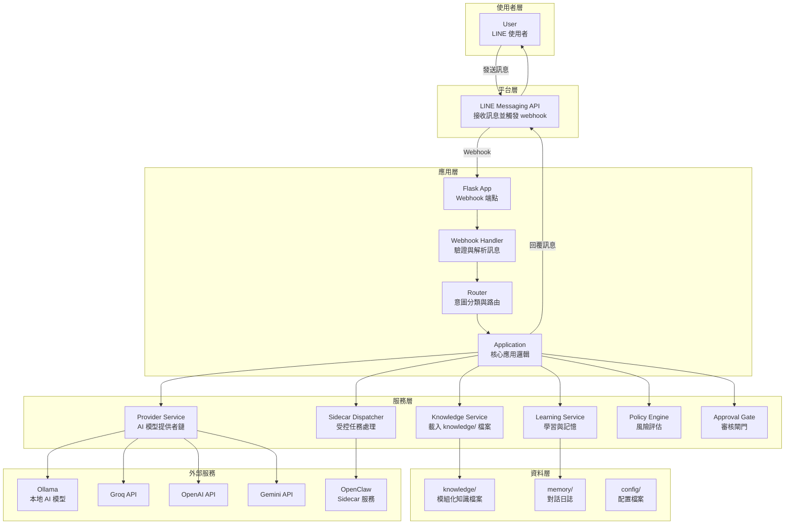

# xlx-bot 系統架構

本文件描述 xlx-bot 的實際系統架構，基於 Flask + LINE Messaging API + 多模型 provider + 模組化知識庫 + 受控 sidecar。

## xlx-bot 架構圖

## Sidecar Dispatcher 設計（Phase 0/1）

為避免 sidecar 影響主流程，dispatcher 設計採用 **best effort + fail-open fallback**：

- 僅任務型請求觸發 sidecar；事實查詢與公告查詢預設不觸發。
- sidecar timeout / exception / invalid response 時，必須立即回到本地回答路徑。
- sidecar 不可攔截或阻塞 webhook ACK 與 LINE reply 基本流程。
- sidecar 失敗時，對使用者必須使用保守訊息（例如：建議服務暫時不可用，先提供本地保守回答）。

詳細 request/response schema、超時策略、錯誤碼與回退機制請見：`docs/sidecar_design.md`。

## Controlled OpenClaw / Tool Policy（目前實作）

目前程式已落地的控制鏈如下：

1. Router 先區分請求型態：
   - `knowledge_qa`
   - `command`
   - `error_report`
   - `user_correction`
   - `docs_request`
2. 每類請求都必須先對應已註冊工具（`config/tool_registry.yaml`）。
3. `policy_engine` 依工具風險做決策：
   - `low` -> 允許
   - `medium` -> `pending review`
   - `high` -> 禁止
4. `approval_gate` 將 policy 決策轉成最終回應與 fallback。
5. 所有 tool / sidecar / agent 決策都寫入 learning event，保留審計線索。

目前限制：

- 尚未完成真正的外部工具執行
- sidecar / OpenClaw 仍以建議與受控接線為主
- 高風險行為仍固定禁止
