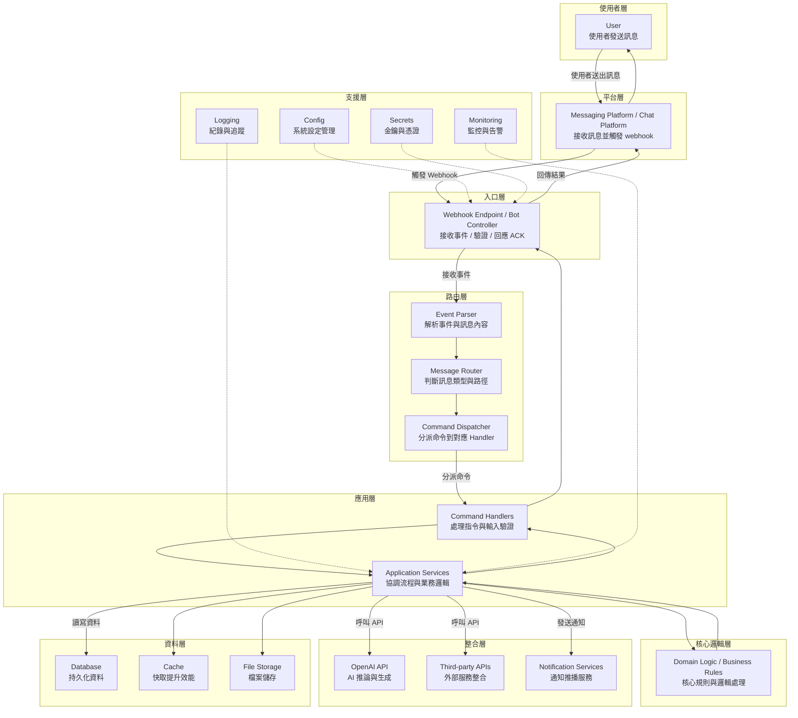

# 系統架構分析

以下為可正常渲染的 Mermaid 架構圖：

```mermaid
flowchart TD
    %% ========== 使用者層 ==========
    subgraph L1[使用者層]
        U[User<br/>使用者發送訊息]
    end

    %% ========== 平台層 ==========
    subgraph L2[平台層]
        MP[Messaging Platform / Chat Platform<br/>接收訊息並觸發 webhook]
    end

    %% ========== 入口層 ==========
    subgraph L3[入口層]
        WH[Webhook Endpoint / Bot Controller<br/>接收事件 / 驗證 / 回應 ACK]
    end

    %% ========== 路由層 ==========
    subgraph L4[路由層]
        EP[Event Parser<br/>解析事件與訊息內容]
        MR[Message Router<br/>判斷訊息類型與路徑]
        CD[Command Dispatcher<br/>分派命令到對應 Handler]
    end

    %% ========== 應用層 ==========
    subgraph L5[應用層]
        CH[Command Handlers<br/>處理指令與輸入驗證]
        AS[Application Services<br/>協調流程與業務邏輯]
    end

    %% ========== 核心邏輯層 ==========
    subgraph L6[核心邏輯層]
        DL[Domain Logic / Business Rules<br/>核心規則與邏輯處理]
    end

    %% ========== 整合層 ==========
    subgraph L7[整合層]
        OA[OpenAI API<br/>AI 推論與生成]
        TP[Third-party APIs<br/>外部服務整合]
        NS[Notification Services<br/>通知推播服務]
    end

    %% ========== 資料層 ==========
    subgraph L8[資料層]
        DB[Database<br/>持久化資料]
        CA[Cache<br/>快取提升效能]
        FS[File Storage<br/>檔案儲存]
    end

    %% ========== 支援層 ==========
    subgraph L9[支援層]
        CFG[Config<br/>系統設定管理]
        SEC[Secrets<br/>金鑰與憑證]
        LOG[Logging<br/>紀錄與追蹤]
        MON[Monitoring<br/>監控與告警]
    end

    %% ========== 主流程 ==========
    U -->|使用者送出訊息| MP
    MP -->|觸發 Webhook| WH
    WH -->|接收事件| EP
    EP --> MR
    MR --> CD
    CD -->|分派命令| CH
    CH --> AS
    AS --> DL

    %% ========== Service 呼叫 ==========
    AS -->|呼叫 API| OA
    AS -->|呼叫 API| TP
    AS -->|發送通知| NS

    AS -->|讀寫資料| DB
    AS --> CA
    AS --> FS

    %% ========== 回傳流程 ==========
    DL --> AS
    AS --> CH
    CH --> WH
    WH -->|回傳結果| MP
    MP --> U

    %% ========== 支援層關聯 ==========
    CFG -.-> WH
    SEC -.-> WH
    LOG -.-> AS
    MON -.-> AS
```
