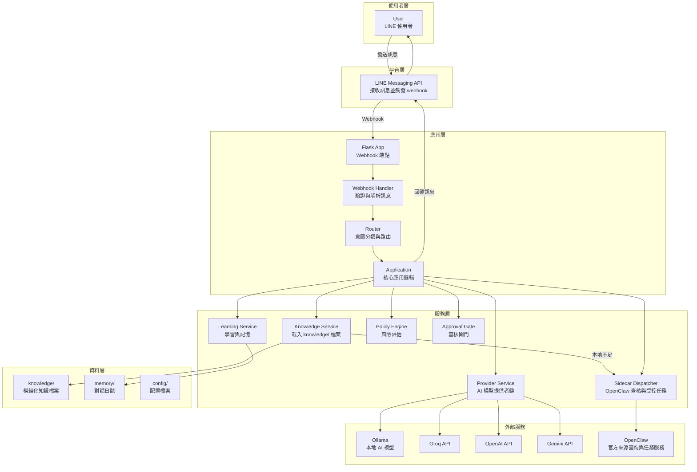

# xlx-bot 系統架構

本文件描述 xlx-bot 的實際系統架構，基於 Flask + LINE Messaging API + 多模型 provider + 模組化知識庫 + OpenClaw 驅動資料查核流程。

## xlx-bot 架構圖

## OpenClaw Dispatcher 設計

dispatcher 採用 **local-first + OpenClaw verification + fail-safe fallback**：

- 事實查詢、公告查詢、現任名單、課程活動與問題分析都先查本地 `knowledge/`。
- 本地知識不足、過期或只有待補標記時，必須透過 OpenClaw 查詢已核可官方來源，例如官網首頁 `https://tmc1974.com/`、課表 `https://tmc1974.com/schedule/`、當期幹部 `https://tmc1974.com/leaders/`、理事會 `https://tmc1974.com/board-members/`、Instagram `https://www.instagram.com/taipeitoastmasters/`、YouTube `https://www.youtube.com/user/1974toastmaster`、Flickr 相簿 `https://www.flickr.com/photos/133676498@N06/albums/`、公告與課程分類頁。
- OpenClaw 查核結果必須帶來源與查核狀態；不得只把模型推測當成事實。
- sidecar timeout / exception / invalid response 時，必須回到保守回答路徑，說明本地與官方查核都不足或目前查核服務不可用。
- sidecar 不可攔截或阻塞 webhook ACK 與 LINE reply 基本流程。
- sidecar 失敗時，對使用者必須使用保守訊息，不可假裝已完成查核。

詳細 request/response schema、超時策略、錯誤碼與回退機制請見：`docs/sidecar_design.md`。

## Controlled OpenClaw / Tool Policy（目前實作）

目前程式已落地的控制鏈如下：

1. Router 先區分請求型態：
   - `knowledge_qa`
   - `command`
   - `error_report`
   - `user_correction`
   - `docs_request`
2. 每類請求都必須先對應已註冊工具（`config/tool_registry.yaml`）。
3. `policy_engine` 依工具風險做決策：
   - `low` -> 允許，例如本地知識查詢與 OpenClaw 官方來源查核
   - `medium` -> `pending review`
   - `high` -> 禁止
4. `approval_gate` 將 policy 決策轉成最終回應與 fallback。
5. 所有 tool / sidecar / agent 決策都寫入 learning event，保留審計線索。

目前限制：

- OpenClaw 查詢結果仍需來源標記與審計紀錄
- OpenClaw 查到的新資料不會自動寫入正式 `knowledge/`，需經人工審核後整理
- 高風險行為仍固定禁止
